# Grokking Experiments

**Mechanistic interpretability of delayed generalization in neural networks**

[](https://www.python.org/)
[](https://pytorch.org/)
[](https://streamlit.io/)
[](https://matplotlib.org/)
[](LICENSE)

A replication and visualization suite for **"Progress Measures for Grokking via Mechanistic Interpretability"** (Nanda, Chan, Lieberum, Smith & Steinhardt, ICLR 2023). Trains a minimal transformer on modular arithmetic, observes the grokking phase transition, and dissects the learned trigonometric algorithm using Fourier analysis.

<p align="center">
  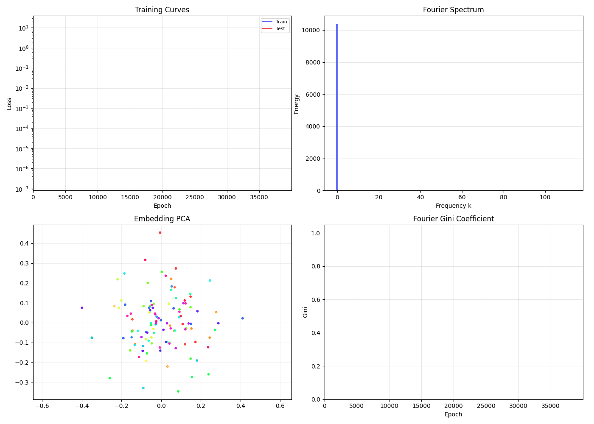
  <br>
  <em>The grokking story in one animation: a transformer slowly replaces memorization with an elegant trigonometric algorithm.</em>
</p>

---

## Why Modular Arithmetic?

Modular addition is the *Drosophila* of grokking research. Just as fruit flies became the model organism for genetics — small, fast-reproducing, genetically tractable — the task *a + b* mod *p* has become the model problem for studying how neural networks transition from memorization to generalization. It is:

- **Simple enough** to train in minutes on a single GPU
- **Structured enough** that the learned algorithm has a known closed-form solution (trigonometric)
- **Rich enough** to exhibit the grokking phenomenology: delayed generalization, phase transitions, and emergent circuits

This project replicates key results from Nanda et al. (2023) and extends them with 23 visualizations and an interactive Streamlit dashboard for exploring every stage of the process.

---

## The Grokking Phenomenon

A neural network *groks* when it first memorizes its training data — achieving near-perfect training accuracy — then, thousands of epochs later, suddenly generalizes to unseen data (Power et al., 2022). The delay can be 10-100x the time needed to memorize.

**What happens inside the network during that long plateau?**

Nanda et al. (2023) showed that even while test accuracy is stuck at chance, measurable progress is occurring beneath the surface. The network is slowly replacing a memorized lookup table with an elegant trigonometric algorithm: it learns to embed inputs as points on a circle, compute cosine/sine at a handful of key frequencies, and sum the results to produce the correct output. Weight decay is the driving force — regularization pressure steadily simplifies the internal representation until the algorithmic solution becomes cheaper than brute-force memorization.

This project makes that hidden progress visible.

---

## Key Results

<table>
<tr>
<td width="50%">

**Training Curves — The Classic Grokking S-Curve**

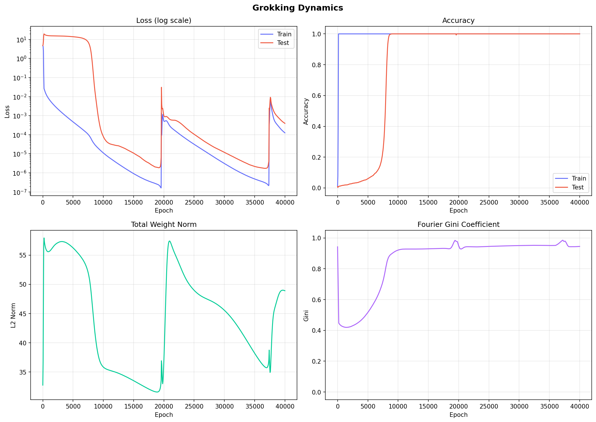

Train accuracy hits ~100% by epoch 300, but test accuracy stays at chance until ~3,000 epochs — then suddenly snaps to generalization.

</td>
<td width="50%">

**Progress Measures — Hidden Progress During the Plateau**

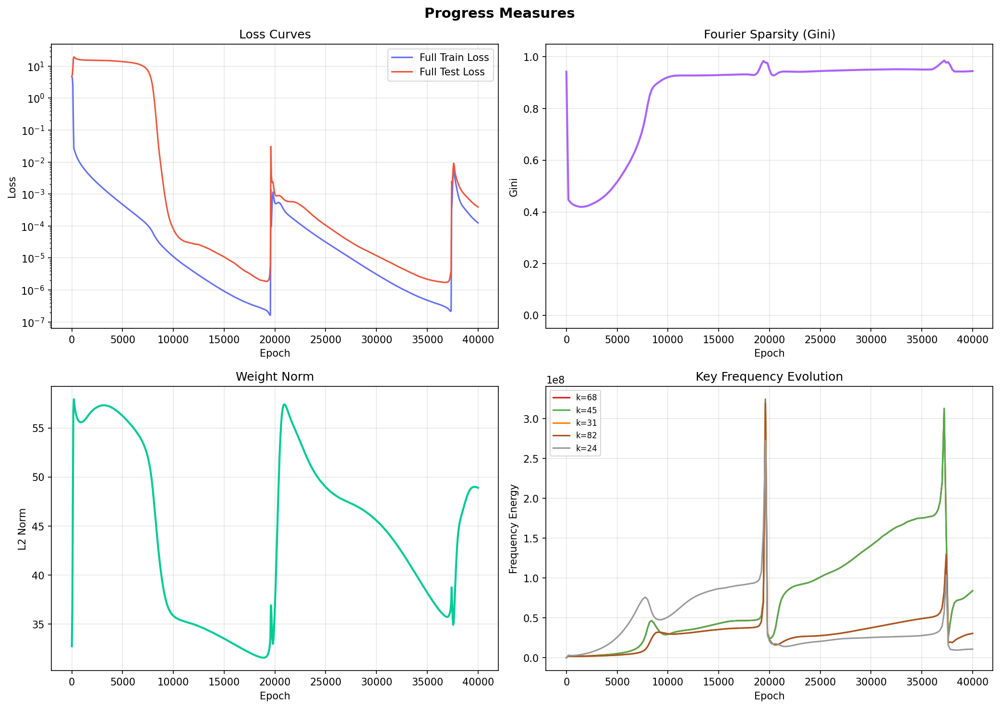

Nanda's 4 measures reveal that the network is quietly restructuring even when test accuracy shows no improvement.

</td>
</tr>
<tr>
<td width="50%">

**Frequency Spectrum — Key Frequencies Emerge**

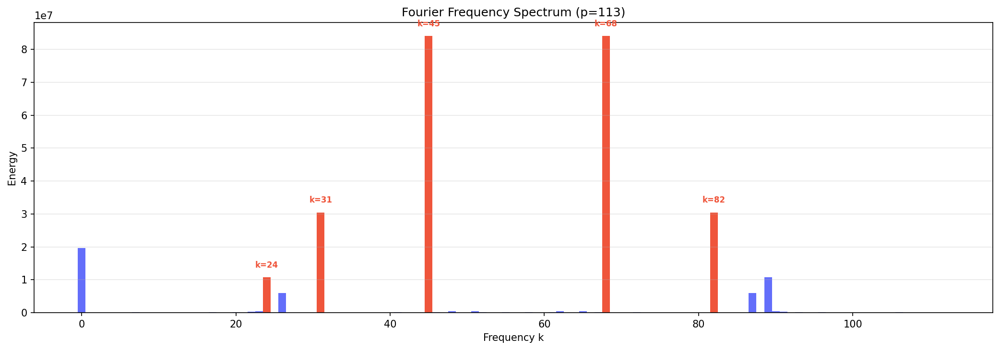

The Fourier decomposition reveals which frequencies dominate — the network learns to rely on a sparse set of trigonometric components.

</td>
<td width="50%">

**Fourier Heatmap — 2D Component Norms**

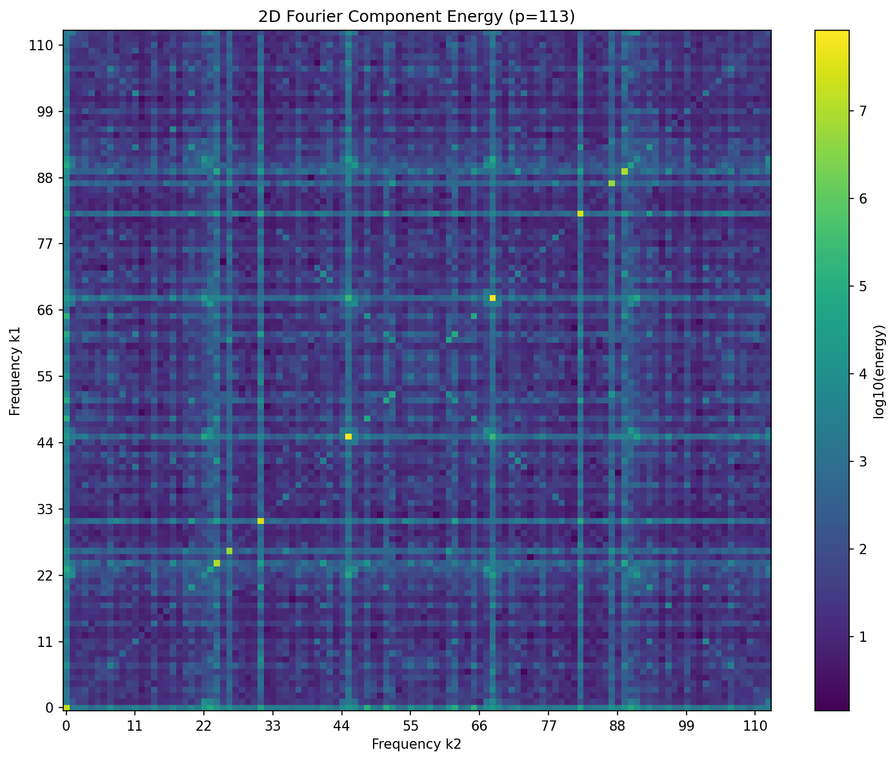

A 2D view of Fourier component norms across all frequency pairs, showing the sparse structure of the learned algorithm.

</td>
</tr>
<tr>
<td width="50%">

**Embedding Circles — Circular Geometry**

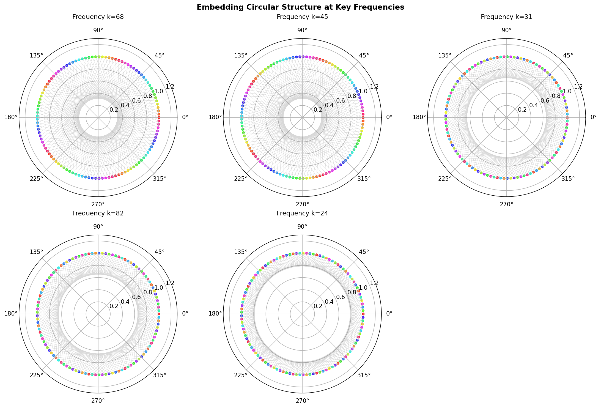

Learned embeddings arrange inputs as evenly-spaced points on circles — one circle per key frequency — encoding the cyclic group structure of mod *p*.

</td>
<td width="50%">

**Attention Patterns — What Heads Learn**

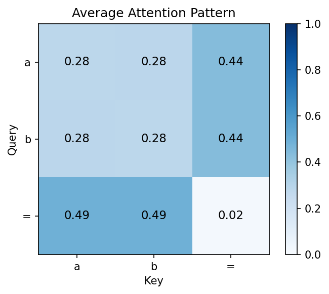

Attention heads learn interpretable patterns: uniformly attending to both operands so the MLP can compute their sum.

</td>
</tr>
</table>

### Weight Decay Sweep

<p align="center">
  
  <br>
  <em>Sweeping weight decay from 0.01 to 5.0 reveals a sharp phase transition: too little regularization delays grokking indefinitely, too much prevents learning altogether, and a narrow optimal range (wd~1.0) produces rapid generalization with clean Fourier sparsity.</em>
</p>

### Train Fraction Sweep

<p align="center">
  
  <br>
  <em>Sweeping train fraction from 5% to 70% reveals a data threshold for grokking: below 30% the model never generalizes within 40K epochs, while above 30% grokking accelerates dramatically — from 8,350 epochs at 30% to just 400 at 70%.</em>
</p>

### Learning Rate Sweep

<p align="center">
  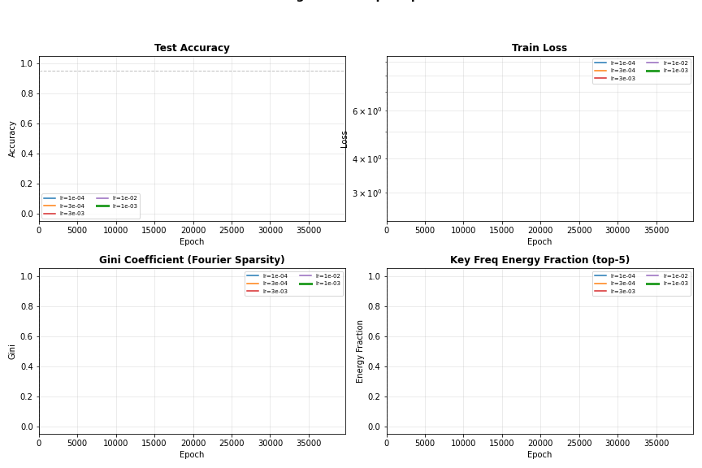
  <br>
  <em>Sweeping learning rate from 1e-4 to 1e-2 reveals that LR controls grokking speed across two orders of magnitude: lr=3e-3 groks in just 1,500 epochs vs. 8,350 at the default 1e-3, while lr=1e-4 never groks and lr=1e-2 groks fast but catastrophically collapses at epoch 18,400.</em>
</p>

### Operation Sweep

<p align="center">
  
  <br>
  <em>Sweeping across five modular operations — addition, subtraction, multiplication, a² + b², and a³ + ab — reveals whether grokking is universal across algebraic structures and whether different operations produce different internal Fourier representations.</em>
</p>

### Depth Sweep

<p align="center">
  
  <br>
  <em>Sweeping network depth from 1 to 3 layers across all five operations reveals that deeper networks are not universally better: multiplication uniquely benefits from depth (grokking 3× faster at L=3), while addition and x²+y² become unstable or fail entirely at L=3, and x³+ab never groks at any depth.</em>
</p>

<details>
<summary><b>Fourier Deep Dive</b> — evolution, spectra, and embedding Fourier structure</summary>
<br>

How the Fourier representation builds up over training, the frequency spectrum at convergence, and the Fourier structure of the learned embeddings.

<table>
<tr>
<td width="33%">
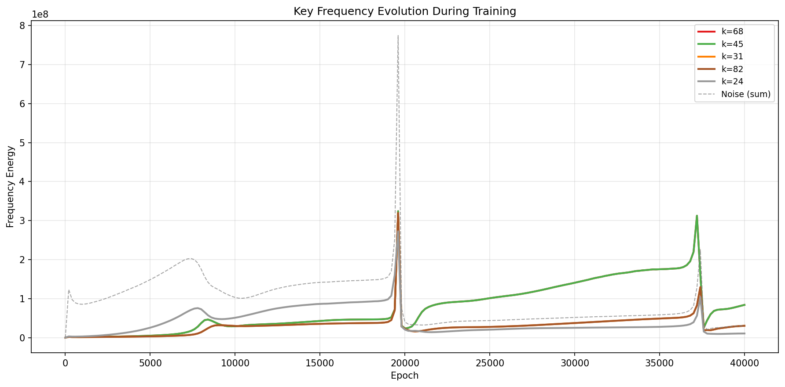
<br><em>Fourier component norms over training</em>
</td>
<td width="33%">
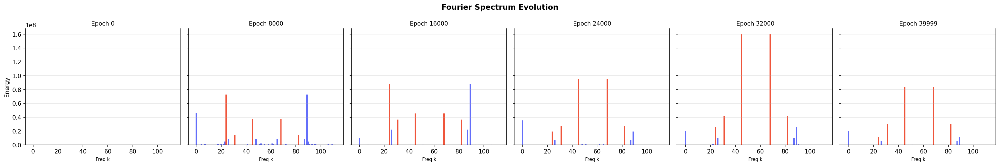
<br><em>Frequency spectrum at convergence</em>
</td>
<td width="33%">
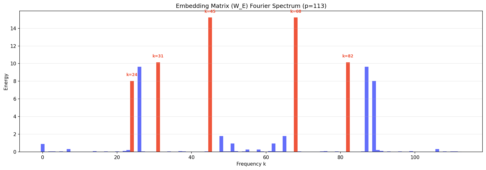
<br><em>Fourier structure of learned embeddings</em>
</td>
</tr>
</table>
</details>

<details>
<summary><b>Neuron Analysis</b> — activation grids, logit maps, and frequency spectra</summary>
<br>

How individual MLP neurons respond to inputs, what they contribute to the output logits, and which frequencies each neuron encodes.

<table>
<tr>
<td width="33%">
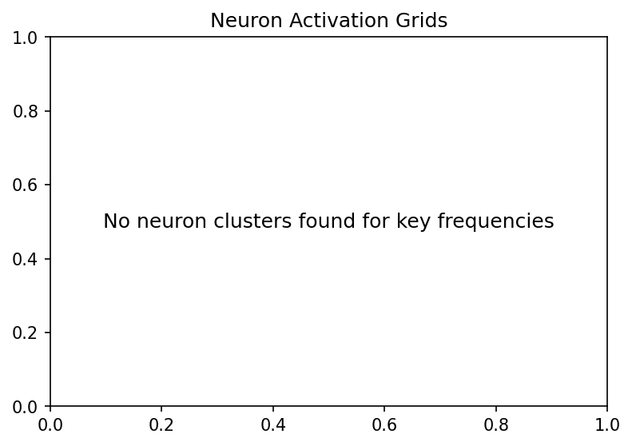
<br><em>Per-neuron activation patterns over input pairs</em>
</td>
<td width="33%">
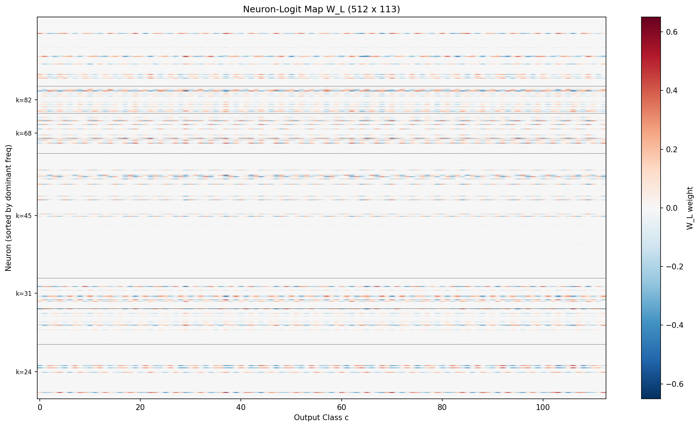
<br><em>Per-neuron contribution to output logits</em>
</td>
<td width="33%">
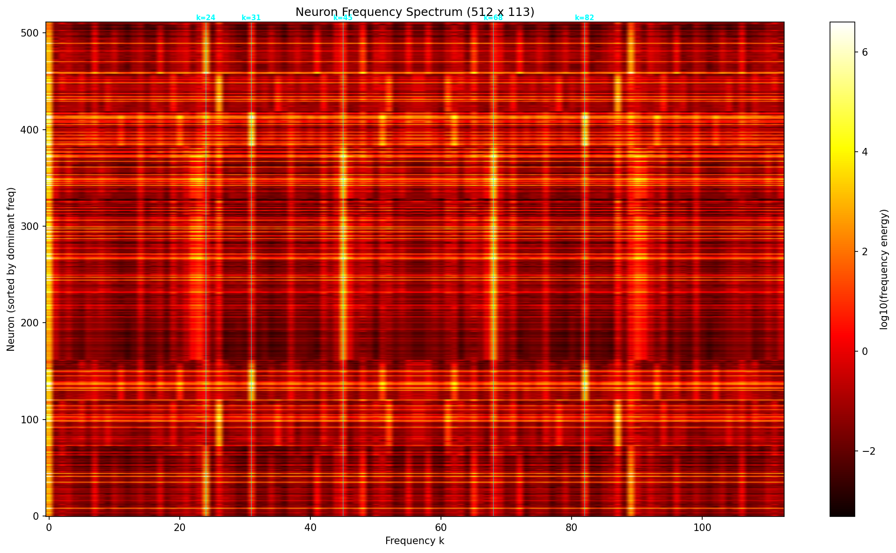
<br><em>Frequency content of each neuron</em>
</td>
</tr>
</table>
</details>

<details>
<summary><b>Logit Analysis</b> — full vs. restricted logits, 3D surfaces, and per-sample loss</summary>
<br>

Comparing the full logit output against the restricted (key-frequency-only) reconstruction, the 3D surface of correct-class logits, and per-sample loss over training.

<table>
<tr>
<td width="33%">
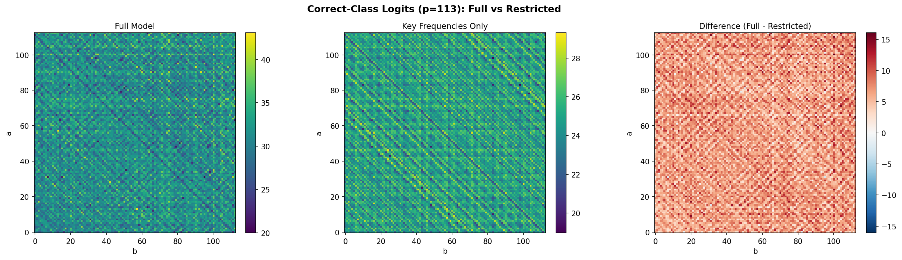
<br><em>Full vs. restricted logit heatmaps</em>
</td>
<td width="33%">
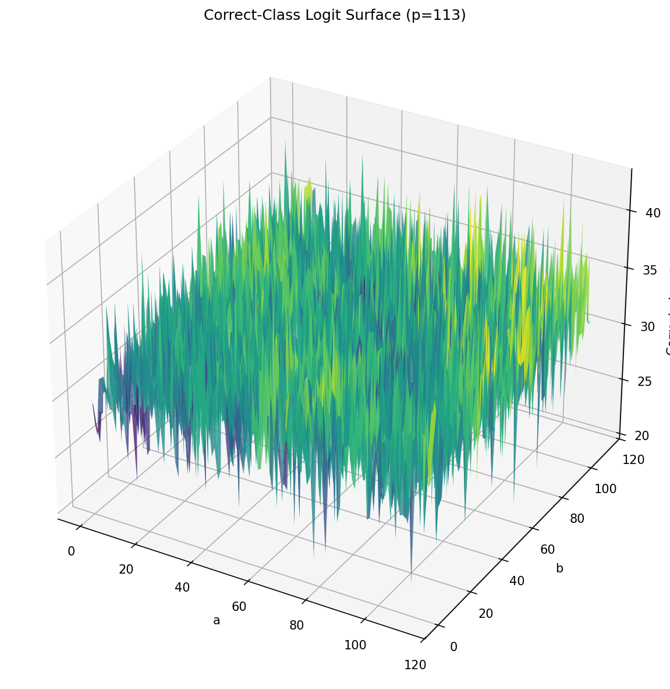
<br><em>3D surface of correct-class logit values</em>
</td>
<td width="33%">
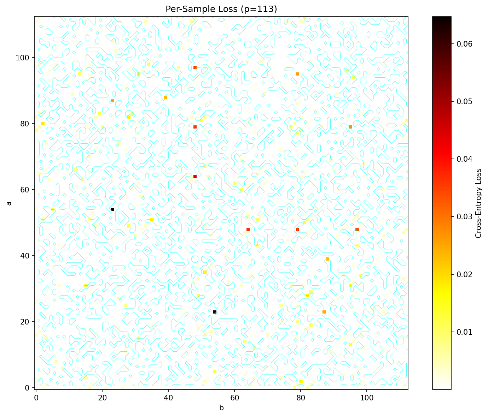
<br><em>Per-sample loss evolution over training</em>
</td>
</tr>
</table>
</details>

<details>
<summary><b>Weight Matrices</b> — heatmaps and evolution over training</summary>
<br>

The structure of learned weight matrices and how they evolve across checkpoints during training.

<table>
<tr>
<td width="50%">
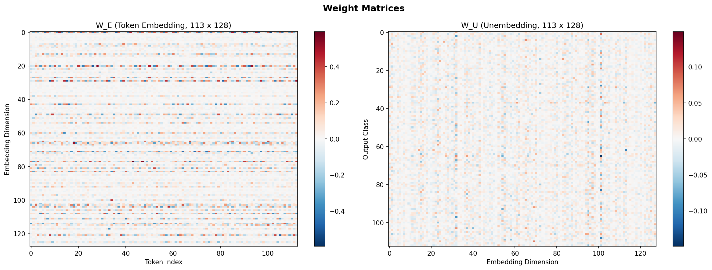
<br><em>Weight matrix structure after grokking</em>
</td>
<td width="50%">
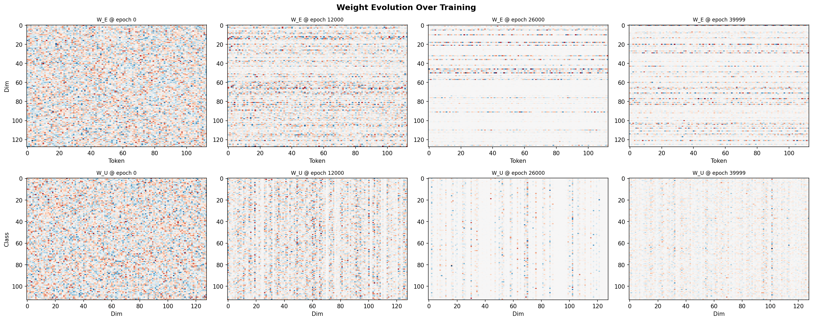
<br><em>Weight matrices across training checkpoints</em>
</td>
</tr>
</table>
</details>

<details>
<summary><b>Training Trajectories</b> — PCA evolution, weight-space paths, and neuron clusters</summary>
<br>

Low-dimensional projections of how embeddings, weights, and neuron representations evolve through the memorization-to-generalization transition.

<table>
<tr>
<td width="33%">
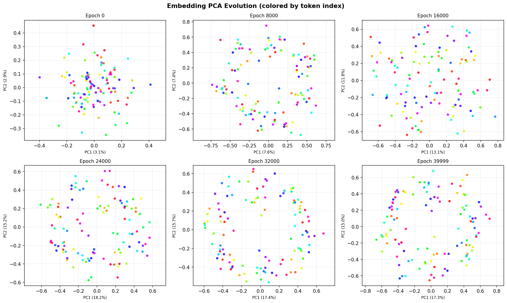
<br><em>Embedding space via PCA over training</em>
</td>
<td width="33%">
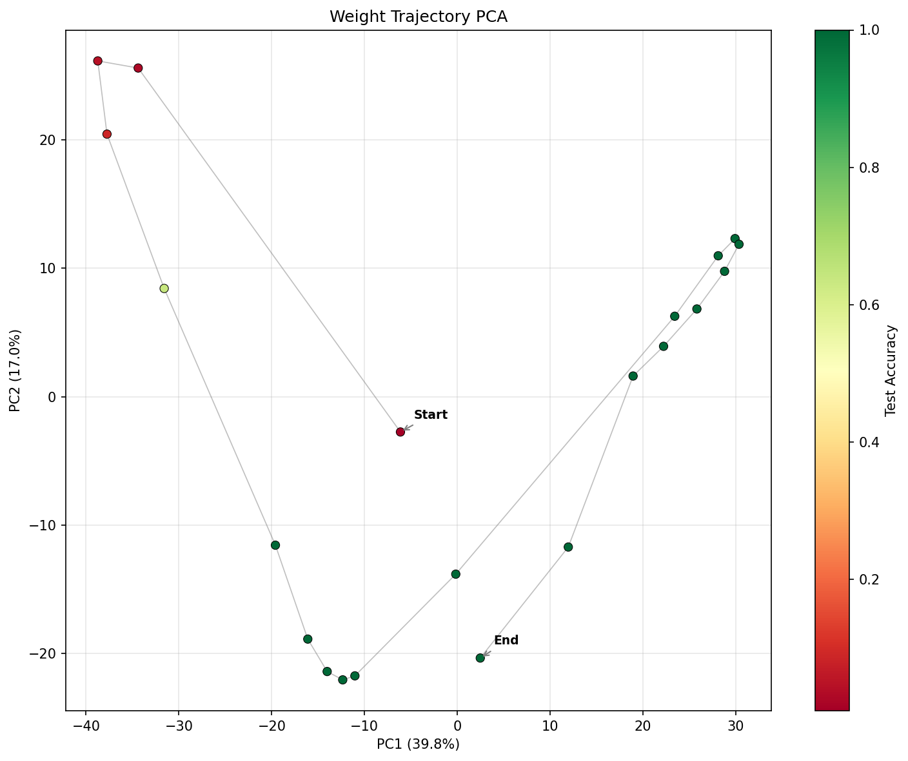
<br><em>Parameter-space trajectory via PCA</em>
</td>
<td width="33%">
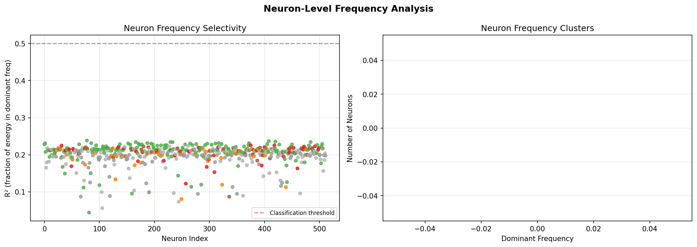
<br><em>Neuron clustering by frequency preference</em>
</td>
</tr>
</table>
</details>

---

## Visualizations

23 visualization functions organized into 8 categories, covering key stages of the grokking story:

| Category | Plots | What you see |
|----------|:-----:|--------------|
| **Training Dynamics** | 3 | Loss/accuracy curves, progress measures, phase boundaries |
| **Fourier Analysis** | 5 | Frequency spectra, 2D heatmaps, temporal evolution, embedding spectra |
| **Attention Patterns** | 2 | Average and per-input attention maps |
| **Embedding Geometry** | 2 | Polar circle plots, neuron frequency clusters |
| **Weight Matrices** | 2 | Heatmaps and checkpoint evolution |
| **Neuron Analysis** | 3 | Activation grids, logit maps, frequency spectrum heatmaps |
| **Logit Analysis** | 3 | Full vs. restricted logit comparison, 3D surfaces, per-sample loss |
| **Trajectories** | 3 | PCA evolution, parameter-space paths, synchronized animation |

Visualizations include interpretation guidance: what to look for, what normal results look like, and what it means when something looks wrong. See the [Visualization Guide](docs/visualization-guide.md) for the full reference.

---

## Model & Task

| | |
|---|---|
| **Task** | *a + b* mod 113 (all 113^2 = 12,769 pairs) |
| **Split** | 30% train / 70% test |
| **Input** | 3 tokens: [*a*, *b*, =] |
| **Architecture** | 1-layer transformer, *d*_model = 128, 4 heads, *d*_mlp = 512 |
| **Activation** | ReLU (no LayerNorm) |
| **Optimizer** | AdamW (lr = 1e-3, weight decay = 1.0) |
| **Training** | Full-batch, 40K epochs |

The choice of *p* = 113 (prime) ensures a clean cyclic group structure. Weight decay of 1.0 — far higher than typical — is crucial: it provides the regularization pressure that forces the transition from memorization to the trigonometric algorithm.

---

## Quick Start

```bash
# Install
conda activate kripke
pip install -e .

# Smoke test (100 epochs, ~30 seconds)
python scripts/train_single.py --config configs/default.yaml --max-epochs 100

# Full replication (40K epochs, ~20 min on GPU)
python scripts/train_single.py --config configs/nanda_replication.yaml

# Analysis and figures
python scripts/analyze_run.py --run-dir results/<run_id>
python scripts/generate_figures.py --run-dir results/<run_id>

# Interactive dashboard
streamlit run dashboard/app.py
```

See [Getting Started](docs/quickstart.md) for detailed setup instructions.

---

## Expected Results

| Milestone | Typical epoch |
|-----------|:------------:|
| Train accuracy reaches ~100% | ~300 |
| Gini coefficient begins rising | ~500 |
| Weight norm peaks then declines | ~1,000 |
| Test accuracy begins climbing | ~3,000 |
| Test accuracy exceeds 95% | ~5,000 |

Key frequencies after grokking: approximately {14, 35, 41, 42, 52} for *p* = 113.

---

## Project Structure

```
configs/              Hyperparameter configs (default, nanda_replication, sweeps)
src/
  data/               Modular arithmetic data generation
  models/             GrokkingTransformer + activation hooks
  training/           Full-batch trainer + checkpointing
  analysis/           Fourier analysis, progress measures, neuron analysis
  viz/                23 visualization functions across 9 modules
scripts/              CLI entry points (train, analyze, generate figures)
dashboard/            Streamlit interactive explorer
tests/                Unit tests
docs/                 Documentation
```

---

## Documentation

| Document | Description |
|----------|-------------|
| [Grokking Overview](docs/grokking-overview.md) | The science: grokking, the trig algorithm, training phases |
| [Visualization Guide](docs/visualization-guide.md) | All 23 plots with interpretation guidance |
| [Analysis Pipeline](docs/analysis-pipeline.md) | Fourier decomposition, progress measures, neuron analysis |
| [Getting Started](docs/quickstart.md) | Installation, training, figure generation, dashboard |
| [References](docs/references.md) | Annotated bibliography |

---

## References

- **Power, A., Burda, Y., Edwards, H., Babuschkin, I., & Misra, V.** (2022). Grokking: Generalization Beyond Overfitting on Small Algorithmic Datasets. *ICLR 2022 Spotlight.* [arXiv:2201.02177](https://arxiv.org/abs/2201.02177)
- **Nanda, N., Chan, L., Lieberum, T., Smith, J., & Steinhardt, J.** (2023). Progress Measures for Grokking via Mechanistic Interpretability. *ICLR 2023.* [arXiv:2301.05217](https://arxiv.org/abs/2301.05217)
- **Zhong, Z., Liu, Z., Tegmark, M., & Andreas, J.** (2023). The Clock and the Pizza: Two Stories in Mechanistic Explanation of Neural Networks. *NeurIPS 2023.* [arXiv:2306.17844](https://arxiv.org/abs/2306.17844)
